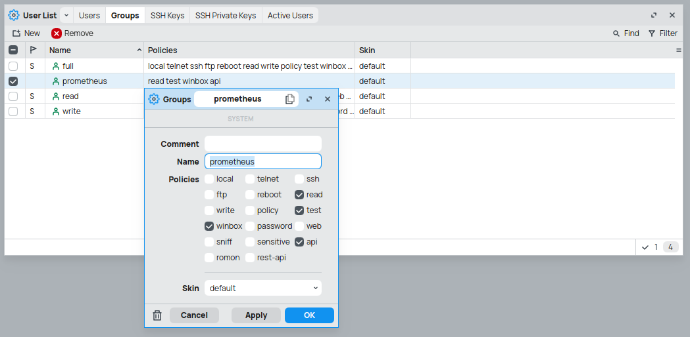
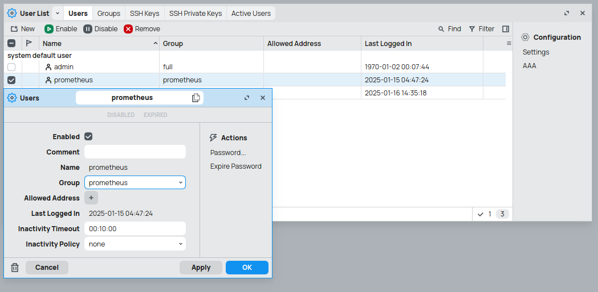

# Monitoring Stack Setup

This repository contains the configuration and setup scripts for a monitoring stack using Grafana, Prometheus, and MikroTik exporter.

## Prerequisites

- Docker
- Docker Compose

## Project Structure

```
.
├── .gitignore 
├── compose.grafana.yaml 
├── compose.mikrotik.yaml 
├── compose.postgresql.yaml 
├── compose.prometheus.yaml 
├── compose.reverse-proxy.yaml 
├── docker-compose.yaml 
├── Makefile
├── README.md
├── configs
│   ├── blackbox
│   ├── grafana
│   ├── influxdb2
│   ├── mktxp
│   ├── postgresql
│   └── prometheus
└── scripts
    └── init.sh
```


## Setup

1. Clone the repository:
    ```sh
    git clone https://github.com/widnyana/monitoring-stack monitoring-stack
    cd monitoring-stack/sentinel
    ```

2. Initialize the setup:
    ```sh
    make init
    ```

3. Start the services:
    ```sh
    # with the included reverse-proxy
    docker compose \
      -f docker-compose.yaml \
      -f compose.grafana.yaml \
      -f compose.mikrotik.yaml \
      -f compose.postgresql.yaml \
      -f compose.prometheus.yaml \
      -f compose.reverse-proxy.yaml \
      up -d 


    # or, without the included reverse-proxy
    docker compose \
      -f docker-compose.yaml \
      -f compose.grafana.yaml \
      -f compose.mikrotik.yaml \
      -f compose.postgresql.yaml \
      -f compose.prometheus.yaml \
      up -d 
    ```

## Services

The ./docker-compose.yaml only contains network definitions, each services has their 
own declaration using `compose.[service].yaml` pattern. Which means you can copy-and
paste each docker compose declarations to your existing docker-compose.yaml.

### PostgreSQL

I'm using PostgreSQL 17 as database server, for now it only stores Grafana related
data

### Grafana

The Grafana configuration file is located [here][1]. The provisioning for dashboards 
and it's datasources is located in [provisioning][2], give it a visit for more info.

In this setup, Grafana is provisioned to use Postgresql as the data storage, you may
use your own database instance or use plain sqlite file when hosting postgres is not
possible on your setup.

### Prometheus

The Prometheus configuration file is located at [configs/prometheus/prometheus.yml][3],
it was preconfigured to scrape its own metrics, grafana metrics, node-exporter metrics,
and mikrotik via mktxp.

### MikroTik Exporter

This setup use [akpw/mktxp][4] as the exporter for Mikrotik's Metrics. Other dashboard 
is also published on [grafana.com][5], so it is possible for you to import it directly
into your existing Grafana instance.

To monitor RouterOS, create a user with only the permissions it needs. MKTXP just need
an API and Read access. You can run the commands in the router's terminal or, if you'd
prefer the GUI, take a look at the image below for guidance.

```routeros
/user group add name=mktxp_group policy=api,read
/user add name=mktxp_user group=mktxp_group password=mktxp_user_password
```





The MikroTik exporter config file can be found at [mktxp.conf][6], see [this file][7] 
if you want to know how it was being used.


### Reverse Proxy

This stack uses nginx-proxy-manager as its reverse proxy by default. If you already 
have a reverse proxy running on your system you can skip it entirely. Simply remove 
`-f compose.reverse-proxy.yaml` from the command shown earlier to disable it.


## License

This project is licensed under the MIT License (MIT). See the LICENSE file for details.

----

[1]: ./configs/grafana/grafana.ini
[2]: ./configs/grafana/provisioning
[3]: ./configs/prometheus/prometheus.yml
[4]: https://github.com/akpw/mktxp "Prometheus Exporter for Mikrotik RouterOS devices"
[5]: https://grafana.com/grafana/dashboards/13679-mikrotik-mktxp-exporter/
[6]: ./configs/mktxp/mktxp.conf "Mikrotik RouterOS prometheus exporter config"
[7]: ./compose.mikrotik.yaml